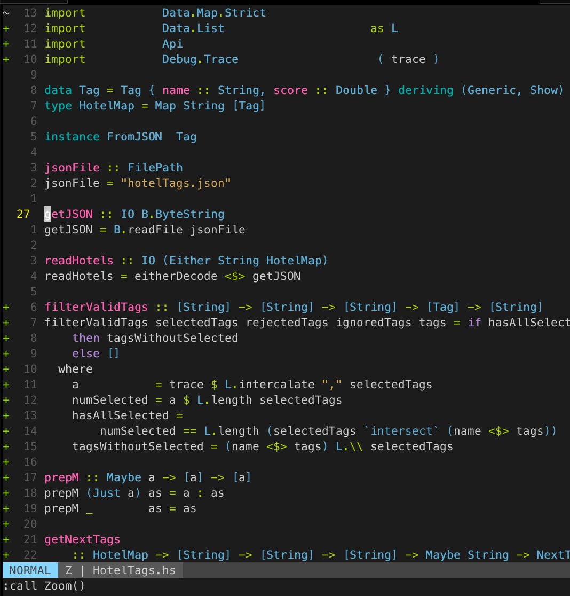

# vimzoom

Minimal plugin to allow tmux like zooming in and out of windows



The plugin gives you a `:Zoom` command that opens the focused window in a new tab. Executing the `:Zoom` command again closes that tab.

If you want to include the zoom state in a statusline you can call the `IsZoomed` function, which returns a `Z` for zoomed or `''` if not zoomed in.

I have if configured to show up in lightline
```vim
let g:lightline = {
      \ 'active': {
      \   'left': [ [ 'mode', 'paste' ],
      \             [  'zoomed', 'readonly', 'filename', 'modified' ] ]
      \ },
      \ 'component_function': {
      \   'zoomed': 'IsZoomed'
      \ },
      \ }
```

You might want to add a keymapping like

`nnoremap <leader>z :Zoom<CR>`

